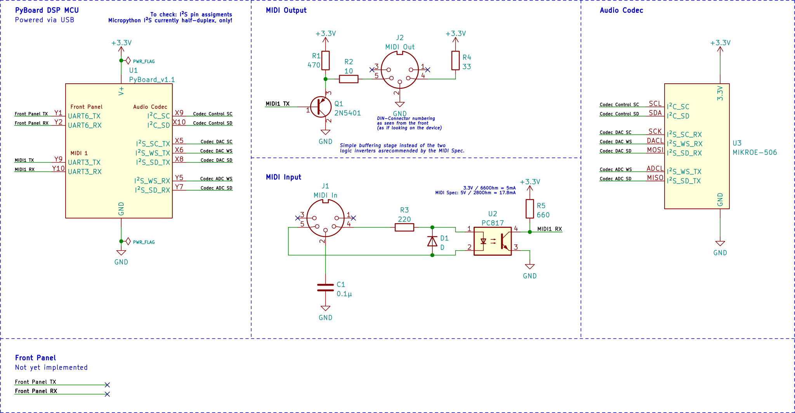

µKlavier – Digital audio synthesizer made with Micropython
===========================================================


Project Description
-------------------

This project is an attempt to build a fully-functional hardware music
synthesizer (aka "sound module") with MicroPython on embedded hardware.
The aim is to build a polyphonic that can be played and controlled via
MIDI, as is typical for table-top or rack-mount sound modules, but can
also be programmed using intuitive hardware controls and a touch screen.

Synthesis is based on a mixture of additive synthesis, subtractive synthesis,
frequency modulation and sampling. Many ideas are drawn from classical
digital synthesizers like the Yamaha DX7, Synclavier and Fairlight CMI.
Still the aim is not to clone any of these, but rather use their unique
features as an inspiration for a modern-day synthesis engine running on
modern-day hardware.

Implementing a modern-day synthesis engine also means using modern-day
tools and programing languages. While it is straight-forward to relay
on C/C++ and well-known frameworks like Juice for DSP audio programing,
this is also an attempt to push the boundaries and use a higher-level
language like Python, instead. At least in theory this should allow for
more compact, robust and easier to understand code at the cost of raw
performance. Hopefully, using the two native code emitters from MicroPython,
it should still be possible to achieve acceptable performance. Another
aim is therefor to examine how far Python can be used for complex real-time
DSP and which benefits there are to it.

<!-- TODO: Images, sound demos, videos, ... once there is something to show  -->


Project Status
--------------

Unfinished prototype in very early development. The current goal is to
develop a proof-of-concept to evaluate the performance of Micropython
on a typical microcontroller for realtime audio synthesis. Once this
is shown to be feasible, the real synthesizer can be implemented.


Build Instructions
------------------

The `./make.py` script automates everything to fetch external dependencies
(like the MicroPython source code) and build everything. For that purpose
the source tree is split into several `sub-projects` defined in `make.conf`:

 * `main`: The main DSP code implementing the synthesizer itself.

 * `panel`: Additional code running on a separate microcontroller to drive a
   touchscreen user interface and several hardware encoders.

 * `research`: Several small experiments to try out different things and
   better understand the usefulness of Python for DSP programming.

Only the `main` project is needed to build a minimal synthesizer that can
be used with an external MIDI controller to access all parameters.

All build actions are always "out of tree", this is, `make.py` places all
its output in a top-level directory called `build`. `./make.py clean` can
be used to delete this directory and start over from scratch. Although most
build commands delete their respective build files first anyway.

Note, that unlike `Make` the script neither builds single source files
(a build is always a full build) nor does it enforce to run certain build
steps before others. Therefor, for an initial full build several commands
must be run in the right order:

```bash
./make.py micropython fetch
./make.py micropython build
./make.py micropython app build
```

Some additional notes:

 * The script should run on all major operating systems, but currently only
  Linux is tested.

 * `./make.py micropython deploy` can be used to flash a freshly built
  MicroPython firmware image to a device.

 * Use `./make.py app build <directory>` to build only a single sub-project.

 * The script has an extensive help system. Use `./make.py help` and
   `./make.py help <command>` to learn more.


Hardware Setup
--------------

The ultimate goal is to design and manufacture a custom PCB and housing.
Until then a stock PyBoard v1.1 with some external peripherals is used
for development and testing:



Notes on the PyBoard prototype:

 * In this early stage the circuit still has some rough edges and is
   mostly untested. It will likely change as more experience is gained.

 * UART6 for communication with the front-panel subsystem is currently
   unused, as this part will be developed later.

 * The PyBoard already contains 4k7 Ohm pull-up resistors for its two
   I²C buses.
 
 * The Audio Codec for testing is a MikroElektronika MIKROE-506 Breakout
   Board using the Cirrus Logic WM8731.

 * It is unclear, whether the Audio Codec can be connected as shown in the drawing.
   As of 09/2022 the Micropython I²S API only supports half-duplex operation for
   either sending or receiving digital audio.

* Therefor currently only the DAC (marked as `I²S_…_TX` on the PyBoard drawing)
  is being tested, as we first need to work with upstream to check if and how
  full-duplex operation with a shared clock can be supported.

Possible enhancements for the custom PCB:

 * Switch to a faster Microcontroller for better DSP performance, if needed.

 * Use the remaining two UARTs for additional MIDI connectors, making it
   possible to integrate MIDI routing features into the firmware.

 * Use the built-in ADCs to hook up expression pedals and/or some analog
   hardware controls.

 * Consider using an ESP32 module to drive the front-panel and touch-screen,
   making use of its built-in WiFi and Bluetooth connectivity. This could
   allow for some interesting additional features like:

    * Receiving Bluetooth audio from mobile devices to play-along.
    * Exchange sample data and sound presets with an external computer.
    * ...

   Mass-data could be exchanged with the DSP Microcontroller via a shared
   SPI-Flash IC.

 * Design a separate Audio/MIDI PCB using I²S and MIDI over UART to communicate
   with the main PCB for more flexible housing.

 * Provide symmetrical audio inputs and outputs out-of-the-box.

 * Maybe add USB audio/MIDI, if technically feasible.

 * Use separate PCB ground and power planes for analog and digital
   circuits.


Copyright
---------

Copyright © 2022  Dennis Schulmeister-Zimolong <dennis@zimolong.eu>

This program is free software: you can redistribute it and/or modify
it under the terms of the GNU Affero General Public License as
published by the Free Software Foundation, either version 3 of the
License, or (at your option) any later version.

This program is distributed in the hope that it will be useful,
but WITHOUT ANY WARRANTY; without even the implied warranty of
MERCHANTABILITY or FITNESS FOR A PARTICULAR PURPOSE.  See the
GNU Affero General Public License for more details.

You should have received a copy of the GNU Affero General Public License
along with this program.  If not, see <http://www.gnu.org/licenses/>.
